# Flutter Multiple Loaders

https://pub.dev/packages/flutter_multiple_loaders

A Flutter package providing a collection of customizable loading animations for your Flutter applications.

<h3 align="center"><i>Define. Get. Set. Done.</i></h3>
<p align="center">
        
        
        
        
        
</p>
<p align="center">
  <a href="https://buymeacoffee.com/maheshlangote" target="https://buymeacoffee.com/maheshlangote">
    
  </a>
</p>

## 🌐 Live Demo

Experience all the loaders in action: **[Flutter Multiple Loaders Demo](https://flutter-multiple-loaders.vercel.app/)**

## Requirements

- Flutter SDK >= 1.17.0
- Dart SDK >= 3.7.2

## Features

This package includes multiple loading animation styles with customizable properties:

### Standard Loaders

- **Spinner Loader**: A classic spinning circular loader
- **Pulse Loader**: A circle that pulses in and out
- **Bounce Loader**: Multiple dots that bounce up and down
- **Wave Loader**: Multiple bars that animate in a wave-like pattern
- **Circle Loader**: A circular progress indicator with customizable properties
- **Dots Loader**: Multiple dots that fade in and out in sequence
- **Rotating Square Loader**: A square that rotates on its center axis
- **Flipping Card Loader**: A card that flips in 3D
- **Glowing Loader**: A circle with pulsing glow effects and gradient colors
- **Typing Loader**: A typing indicator with animated dots, commonly used in chat applications
- **Blinking Loader**: A shape (circle, square, triangle, or star) that fades in and out
- **Ripple Loader**: Concentric circles that expand outward like ripples on water
- **Heartbeat Loader**: A realistic anatomical heart animation with authentic cardiac rhythm patterns
- **Hourglass Loader** *(new in 1.1.0)*: A smooth hourglass with Bézier curves and animated sand flow
- **Clock Loader** *(new in 1.1.0)*: An analog clock face with rotating hour and minute hands

### Innovative Loaders

- **DNA Helix Loader**: An animated double helix that rotates in 3D space with connecting "rungs" between the strands
- **Morphing Shape Loader**: A shape that smoothly transitions between different geometric forms
- **Galaxy Spiral Loader**: A spiral galaxy with stars rotating around a glowing core
- **Particle Vortex Loader**: Mesmerizing particles flowing in a vortex pattern with customizable flow speed and colors
- **Fractal Tree Loader**: A beautiful animated fractal tree that grows and branches organically
- **Liquid Blob Loader**: A morphing liquid-like blob with fluid motion and realistic highlights
- **Page Turning Loader**: A book with smoothly turning pages that simulates a realistic reading animation
- **Heartbeat Loader**: A realistic anatomical heart animation with authentic cardiac rhythm patterns
- **Neon Pulse Loader**: Futuristic cyberpunk-style concentric neon rings with glow effects

### 🛠️ Developer Utilities *(new in 1.1.0)*

- **`MultipleLoaders.showOverlay`** — One-line modal loading barrier that blocks user interaction during async tasks
- **`LoaderFutureBuilder<T>`** — Drop-in `FutureBuilder` wrapper that auto-shows a loader while waiting

All loaders feature:

- Customizable sizes (extra small to extra large)
- Custom colors (primary, secondary, tertiary, and quaternary)
- Adjustable animation speed
- Optional background colors
- Animation control (start, stop, reset)

## Screenshots

### Standard Loaders

| Loader | Preview | Loader | Preview |
|--------|---------|--------|---------|
| **Spinner Loader** | 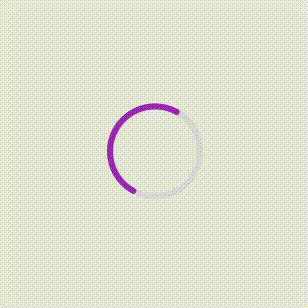 | **Pulse Loader** | 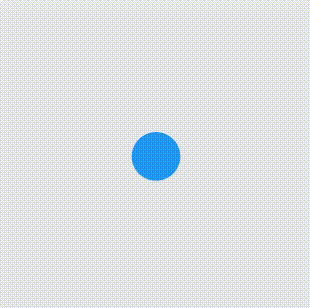 |
| **Bounce Loader** | 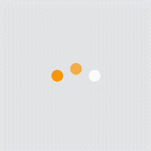 | **Wave Loader** | 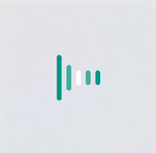 |
| **Circle Loader** | 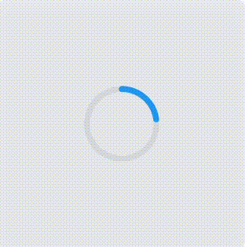 | **Dots Loader** | 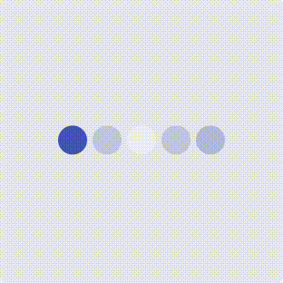 |
| **Rotating Square Loader** | 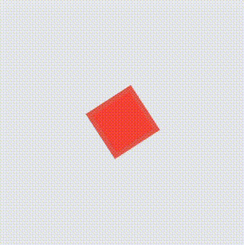 | **Glowing Loader** | 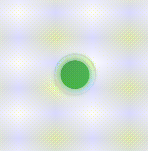 |
| **Typing Loader** | 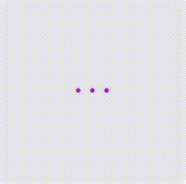 | **Ripple Loader** |  |
| **HeartBeat Loader** |  | **Hourglass Loader** | *(screenshot coming soon)* |
| **Clock Loader** | *(screenshot coming soon)* | | |


### Innovative Loaders Gallery

| Loader | Preview | Loader | Preview |
|--------|---------|--------|---------|
| **DNA Helix Loader** | 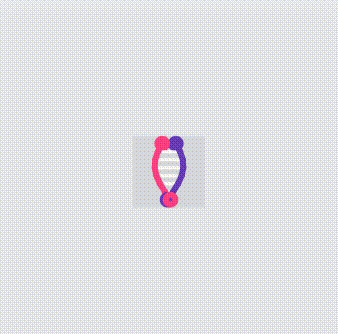 | **Morphing Shape Loader** | 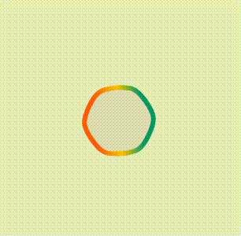 |
| **Galaxy Spiral Loader** | 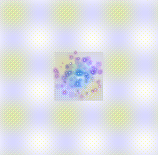 | **Particle Vortex Loader** | 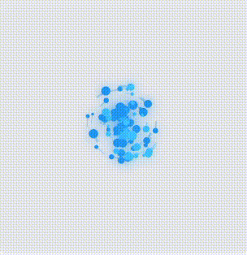 |
| **Fractal Tree Loader** |  | **Liquid Blob Loader** | 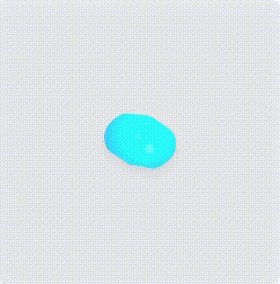 |
| **Flipping Card Loader** | 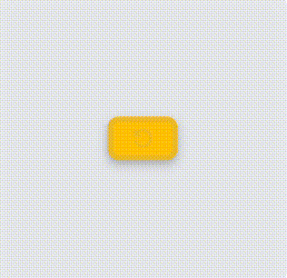 | | |

## Getting started

Add the dependency to your `pubspec.yaml`:

```yaml
dependencies:
  flutter_multiple_loaders: ^1.1.0
```

Then run:

```bash
flutter pub get
```

## Usage

Import the package:

```dart
import 'package:flutter_multiple_loaders/flutter_multiple_loaders.dart';
```

### Basic Usage

Use any of the loaders with default options:

```dart
// Simple spinner animation
SpinnerLoader();

// Pulse animation
PulseLoader();

// Bounce animation
BounceLoader();

// Wave animation
WaveLoader();

// Circle animation
CircleLoader();

// Blinking animation with different shapes
BlinkingLoader();  // default is circle

// Book animation
PageTurningLoader(
  pageCount: 20,
  options: LoaderOptions(
    color: Colors.indigo,
    secondaryColor: Colors.indigoAccent,
    tertiaryColor: Colors.white,
    durationMs: 3500,
  ),
);

// Heartbeat animation
HeartbeatLoader(
  pulseIntensity: 0.4,
  options: LoaderOptions(
    color: Colors.red,
    size: LoaderSize.large,
    durationMs: 2000,
  ),
);

// Hourglass animation (new in 1.1.0)
HourglassLoader(
  options: LoaderOptions(
    color: Colors.amber,
    secondaryColor: Colors.amber.withOpacity(0.35),
    size: LoaderSize.large,
    strokeWidth: 3.0,
    durationMs: 2400,
  ),
);

// Clock animation (new in 1.1.0)
ClockLoader(
  options: LoaderOptions(
    color: Colors.deepPurple,
    secondaryColor: Colors.deepPurpleAccent,
    size: LoaderSize.large,
    strokeWidth: 3.0,
    durationMs: 3000,
  ),
);
```

### 🛠️ Developer Utilities (new in 1.1.0)

#### Loading Overlay Dialog

Display a full-screen loading barrier that blocks user interaction during async tasks:

```dart
// Show the overlay
MultipleLoaders.showOverlay(
  context,
  loader: const SpinnerLoader(
    options: LoaderOptions(
      color: Colors.white,
      size: LoaderSize.large,
    ),
  ),
);

// Perform your async work...
await myLongRunningTask();

// Hide the overlay
MultipleLoaders.hideOverlay(context);
```

#### LoaderFutureBuilder

A drop-in replacement for `FutureBuilder` that automatically shows a loader while the future is pending:

```dart
LoaderFutureBuilder<String>(
  future: myNetworkRequest(),
  loader: const CircleLoader(
    options: LoaderOptions(
      color: Colors.teal,
      size: LoaderSize.large,
      strokeWidth: 4.0,
    ),
  ),
  builder: (context, data) {
    // Only called when the future completes successfully!
    return Text('Loaded: $data');
  },
)
```

### Customizing Loaders

All loaders accept custom options through the `LoaderOptions` class:

```dart
SpinnerLoader(
  options: LoaderOptions(
    color: Colors.purple,
    size: LoaderSize.large,
    durationMs: 1000,
    loop: true,
  ),
);

// Multi-colored wave loader
WaveLoader(
  barCount: 5,
  options: LoaderOptions(
    color: Colors.blue,
    secondaryColor: Colors.green,
    tertiaryColor: Colors.orange,
    size: LoaderSize.medium,
  ),
);
```

### Controlling Animation Programmatically

Use the `LoaderController` to control the animation:

```dart
class _MyWidgetState extends State<MyWidget> {
  final LoaderController _controller = LoaderController();

  @override
  Widget build(BuildContext context) {
    return Column(
      children: [
        SpinnerLoader(controller: _controller),

        ElevatedButton(
          onPressed: () => _controller.start(),
          child: Text('Start'),
        ),

        ElevatedButton(
          onPressed: () => _controller.stop(),
          child: Text('Stop'),
        ),

        ElevatedButton(
          onPressed: () => _controller.reset(),
          child: Text('Reset'),
        ),
      ],
    );
  }
}
```

## Interactive Example

The package includes a complete example app that demonstrates all loaders with interactive controls for customization. The example app allows you to:

- Switch between different loader types via category tabs (Standard / Innovative)
- Change sizes, colors, and stroke widths via the control panel
- Control animation duration
- Start, stop, and reset animations
- Try interactive **Developer Utilities** demos (Overlay & FutureBuilder)
- Copy ready-to-use code snippets for every loader

Check the [example](./example) folder for more detailed usage examples.

## Additional information

### Contributing

Contributions are welcome! Feel free to open an issue or submit a pull request.

### License

This package is licensed under the MIT License - see the [LICENSE](LICENSE) file for details.
