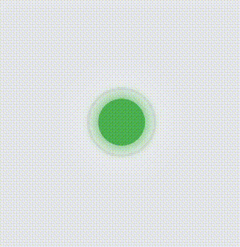

# Flutter Multiple Loaders

A Flutter package providing a collection of customizable loading animations for your Flutter applications.

<h3 align="center"><i>Define. Get. Set. Done.</i></h3>
<p align="center">
        
        
        
        
        
</p>
<p align="center">
  <a href="https://buymeacoffee.com/maheshlangote" target="https://buymeacoffee.com/maheshlangote">
    
  </a>
</p>
## Features

This package includes multiple loading animation styles with customizable properties:

- **Spinner Loader**: A classic spinning circular loader
- **Pulse Loader**: A circle that pulses in and out
- **Bounce Loader**: Multiple dots that bounce up and down
- **Wave Loader**: Multiple bars that animate in a wave-like pattern
- **Circle Loader**: A circular progress indicator with customizable properties
- **Dots Loader**: Multiple dots that fade in and out in sequence
- **Rotating Square Loader**: A square that rotates on its center axis
- **Glowing Loader**: A circle with pulsing glow effects and gradient colors
- **Typing Loader**: A typing indicator with animated dots, commonly used in chat applications
- **Blinking Loader**: A shape (circle, square, triangle, or star) that fades in and out

### Innovative Loaders

- **DNA Helix Loader**: An animated double helix that rotates in 3D space with connecting "rungs" between the strands
- **Morphing Shape Loader**: A shape that smoothly transitions between different geometric forms
- **Galaxy Spiral Loader**: A spiral galaxy with stars rotating around a glowing core
- **Particle Vortex Loader**: Mesmerizing particles flowing in a vortex pattern with customizable flow speed and colors
- **Fractal Tree Loader**: A beautiful animated fractal tree that grows and branches organically
- **Liquid Blob Loader**: A morphing liquid-like blob with fluid motion and realistic highlights
- **Page Turning Loader**: A book with smoothly turning pages that simulates a realistic reading animation with enhanced 3D perspective, dynamic shadows, natural page bending, and realistic content visualization

All loaders feature:

- Customizable sizes (extra small to extra large)
- Custom colors (primary, secondary, and tertiary)
- Adjustable animation speed
- Optional background colors
- Animation control (start, stop, reset)

## Screenshots

### Standard Loaders

| Loader | Preview | Loader | Preview |
|--------|---------|--------|---------|
| **Spinner Loader** |  | **Pulse Loader** |  |
| **Bounce Loader** |  | **Wave Loader** |  |
| **Circle Loader** |  | **Dots Loader** |  |
| **Rotating Square Loader** |  | **Glowing Loader** |  |
| **Typing Loader** |  |  |  |

### Innovative Loaders Gallery

| Loader | Preview | Loader | Preview |
|--------|---------|--------|---------|
| **DNA Helix Loader** |  | **Morphing Shape Loader** |  |
| **Galaxy Spiral Loader** |  | **Particle Vortex Loader** |  |
| **Fractal Tree Loader** |  | **Liquid Blob Loader** |  |
| **Flipping Card Loader** |  |  |  |

## Getting started

Add the dependency to your `pubspec.yaml`:

```yaml
dependencies:
  flutter_multiple_loaders: ^0.0.7
```

Then run:

```bash
flutter pub get
```

## Usage

Import the package:

```dart
import 'package:flutter_multiple_loaders/flutter_multiple_loaders.dart';
```

### Basic Usage

Use any of the loaders with default options:

```dart
// Simple spinner animation
SpinnerLoader();

// Pulse animation
PulseLoader();

// Bounce animation
BounceLoader();

// Wave animation
WaveLoader();

// Circle animation
CircleLoader();

// Blinking animation with different shapes
BlinkingLoader();  // default is circle

// Book animations
PageTurningLoader(
  pageCount: 20,  // Number of pages in the book
  options: LoaderOptions(
    color: Colors.indigo,        // Cover color
    secondaryColor: Colors.indigoAccent,  // Text/content color
    tertiaryColor: Colors.white, // Page color
    durationMs: 3500,            // Animation duration
  ),
); 

// Shape animations
BlinkingLoader(shape: BlinkingShape.square);
BlinkingLoader(shape: BlinkingShape.triangle);
BlinkingLoader(shape: BlinkingShape.star);

// Dots animation
DotsLoader();
```

### Customizing Loaders

All loaders accept custom options through the `LoaderOptions` class:

```dart
// Customized spinner loader
SpinnerLoader(
  options: LoaderOptions(
    color: Colors.purple,
    size: LoaderSize.large,
    durationMs: 1000,
    loop: true,
  ),
);

// Multi-colored wave loader
WaveLoader(
  barCount: 5,
  options: LoaderOptions(
    color: Colors.blue,
    secondaryColor: Colors.green,
    tertiaryColor: Colors.orange,
    size: LoaderSize.medium,
  ),
);

// Customized blinking star loader
BlinkingLoader(
  shape: BlinkingShape.star,
  options: LoaderOptions(
    color: Colors.amber,
    size: LoaderSize.extraLarge,
    durationMs: 800,
    loop: true,
  ),
);
```

### Controlling Animation Programmatically

Use the `LoaderController` to control the animation:

```dart
class _MyWidgetState extends State<MyWidget> {
  final LoaderController _controller = LoaderController();

  @override
  Widget build(BuildContext context) {
    return Column(
      children: [
        SpinnerLoader(controller: _controller),

        ElevatedButton(
          onPressed: () => _controller.start(),
          child: Text('Start'),
        ),

        ElevatedButton(
          onPressed: () => _controller.stop(),
          child: Text('Stop'),
        ),

        ElevatedButton(
          onPressed: () => _controller.reset(),
          child: Text('Reset'),
        ),
      ],
    );
  }
}
```

## Interactive Example

The package includes a complete example app that demonstrates all loaders with interactive controls for customization:

The example app allows you to:

- Switch between different loader types
- Change sizes and colors
- Control animation duration
- Start, stop, and reset animations

Check the [example](./example) folder for more detailed usage examples.

## Additional information

### Contributing

Contributions are welcome! Feel free to open an issue or submit a pull request.

### License

This package is licensed under the MIT License - see the [LICENSE](LICENSE) file for details.
